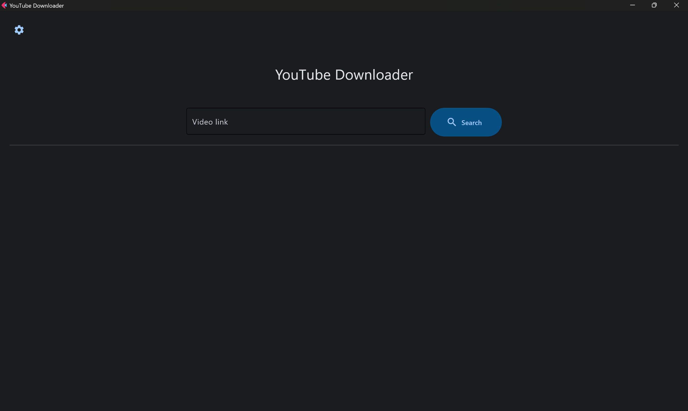
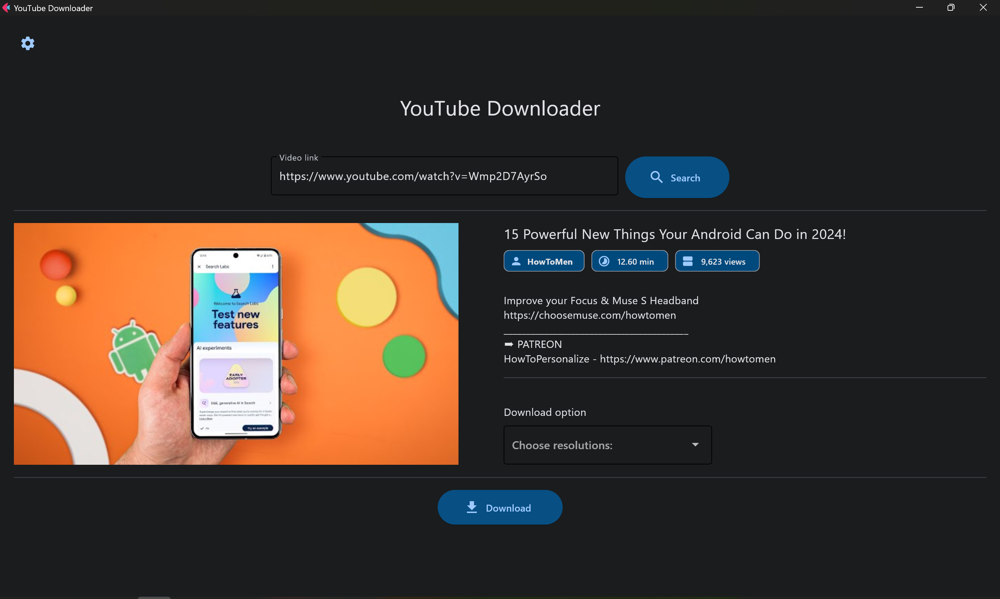
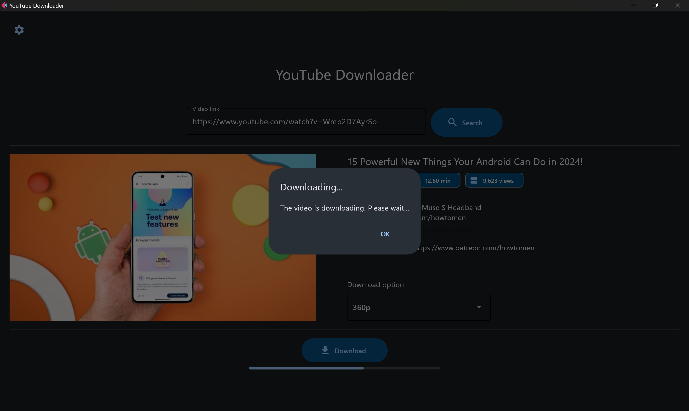
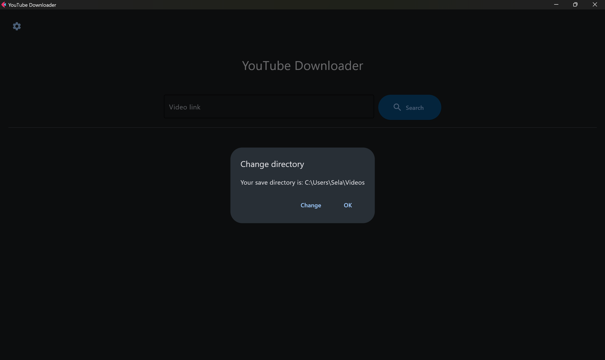

# A youtube Flet app

A minimal flet app using flet and pytube

To run the app:

```
flet run [app_directory]
```

App preview




the resolutions is auto get from the video quality on youtube


the download option will be base on the res that user selected



user can change directory that they previously selected